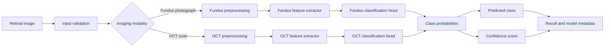
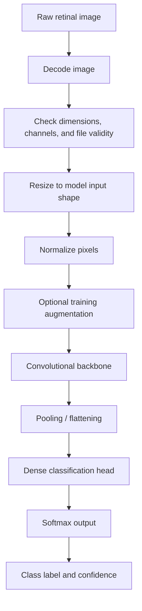
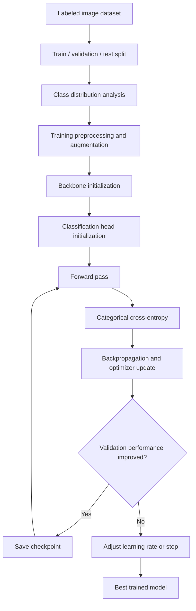
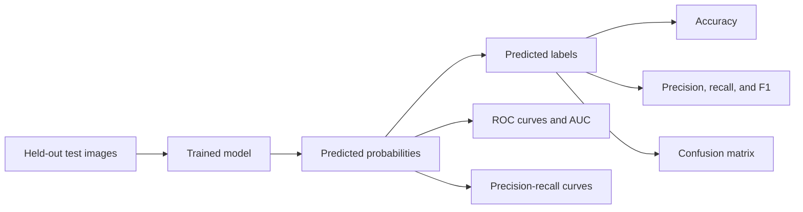
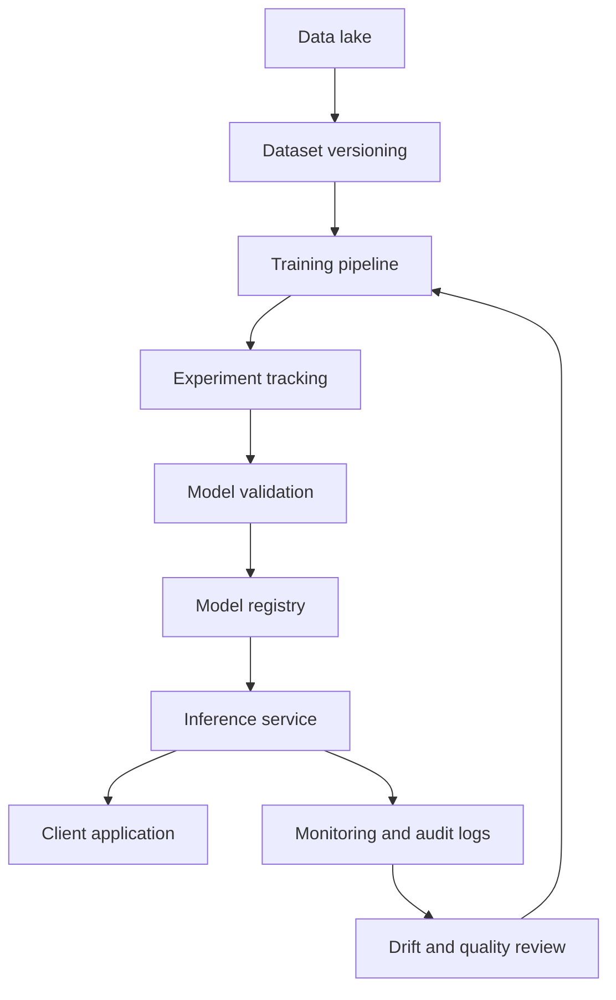

# EyeCare

EyeCare is a deep-learning system for automated retinal-image classification. The system accepts a retinal image, identifies the imaging modality, applies modality-specific preprocessing, extracts visual features with a convolutional neural network, and returns a probability distribution over the supported retinal conditions.

> **Safety notice:** EyeCare is a research prototype. It is not a medical device and must not be used as the sole basis for diagnosis or treatment.

## System architecture



The architecture is organized into six logical layers:

1. **Input layer** validates the image and identifies the imaging modality.
2. **Preprocessing layer** resizes and normalizes the image according to the selected model.
3. **Feature-extraction layer** converts image pixels into high-level retinal features using a convolutional backbone.
4. **Classification layer** maps extracted features to the target disease classes with a softmax output.
5. **Decision layer** selects the highest-probability class and exposes the associated confidence score.
6. **Evaluation and deployment layer** measures model quality and provides an optimized model artifact for inference.

## End-to-end data flow



During training, labeled images pass through the same preprocessing path used for inference. Training-only augmentation creates controlled variations of the input images to reduce overfitting. Validation and test data use deterministic preprocessing so that reported metrics measure the model rather than random image transformations.

During inference, augmentation is disabled. The input is decoded, resized, normalized, passed through the trained network, and converted into a class prediction.

## Modality architecture

EyeCare contains two specialized classification branches because fundus photographs and OCT scans have different visual characteristics.

### Fundus branch

The fundus branch processes RGB photographs of the retina. These images contain a two-dimensional view of structures such as the optic disc, retinal vessels, macula, and surrounding retinal tissue.

The branch supports four output classes:

| Output class | Description |
| --- | --- |
| `cataract` | Cataract-related label in the source data |
| `diabetic retinopathy` | Diabetic-retinopathy label in the source data |
| `glaucoma` | Glaucoma-related label in the source data |
| `normal` | No target abnormality in the source label |

The fundus models use transfer learning or fine-tuning. An ImageNet-pretrained convolutional backbone extracts general visual features. A task-specific classification head then converts those features into four disease probabilities.


### OCT branch

The OCT branch processes cross-sectional retinal scans. The supported output classes are:

| Output class | Description |
| --- | --- |
| `CNV` | Choroidal neovascularization |
| `DME` | Diabetic macular edema |
| `DRUSEN` | Retinal drusen |
| `NORMAL` | Normal retinal OCT appearance |

The OCT branch supports both a custom convolutional network and pretrained convolutional backbones. The custom network learns low-level edges and textures first, then progressively higher-level retinal patterns as the number of convolutional filters increases.


## Neural-network architecture

### Convolutional feature extraction

The convolutional backbone is responsible for learning spatial features from the retinal image. Early layers detect simple structures such as edges, intensity changes, and local textures. Deeper layers combine these features into more meaningful patterns associated with retinal anatomy or pathology.

EyeCare uses two backbone strategies:

- **Custom CNN:** convolutional layers are initialized and learned specifically for the OCT classification task.
- **Transfer-learning backbone:** a model pretrained on ImageNet is reused as a visual feature extractor and adapted to retinal classification.

The transfer-learning experiments use EfficientNetB2, EfficientNetB7, VGG16, and MobileNet. These models remove their original ImageNet classification layer and attach a new retinal classification head.

### Classification head

The classification head converts the feature map produced by the backbone into class probabilities. Depending on the branch, it uses global average pooling or flattening, followed by dense layers and dropout. The final layer uses softmax activation:

```text
features → pooling / flattening → dense representation → softmax probabilities
```

For a four-class problem, the softmax output is:

```text
[p(class_1), p(class_2), p(class_3), p(class_4)]
```

The probabilities sum to one. The predicted class is the class with the largest probability.

### Regularization and optimization

The architecture uses several mechanisms to improve generalization:

- **Dropout** randomly disables part of the classification head during training.
- **L2 regularization** penalizes excessively large weights in the custom CNN.
- **Data augmentation** exposes the model to small variations in training images.
- **Class weighting** gives additional importance to under-represented classes.
- **Early stopping** can restore the best validation model instead of keeping a later overfit version.
- **Learning-rate scheduling** adjusts the optimizer step size during training.

The primary optimization objective is categorical cross-entropy. Adam is used in the main model configurations, while some comparative experiments use other optimizers.

## Input and preprocessing architecture

The preprocessing layer must match the model that consumes its output. A mismatch between training and inference preprocessing can invalidate predictions.

The common preprocessing sequence is:

1. Decode the image from its file representation.
2. Confirm that the image is readable and has the expected color channels.
3. Resize it to the selected network input shape.
4. Convert pixel values to the numeric range expected by the model.
5. Apply the backbone-specific preprocessing function when required.
6. Add the batch dimension before inference.

The model configurations use different spatial input sizes. Examples include `128 × 128`, `224 × 224`, and `256 × 256`. The selected size is part of the model contract and must be stored with the model artifact.

Training data is organized by class directories or equivalent label mappings. A conceptual layout is:

```text
data/
├── train/
│   ├── class_1/
│   ├── class_2/
│   ├── class_3/
│   └── class_4/
├── validation/
│   ├── class_1/
│   ├── class_2/
│   ├── class_3/
│   └── class_4/
└── test/
    ├── class_1/
    ├── class_2/
    ├── class_3/
    └── class_4/
```

The label order must remain fixed between training, evaluation, and inference. The model output index is meaningful only when it is mapped to the same label list used during training.

## Training architecture



The training process is supervised. Each image is paired with a target class. The network produces a probability vector, compares it with the target label, computes the loss, and updates trainable weights.

Transfer learning divides the training process into two possible stages:

1. **Feature-extractor stage:** keep most backbone layers frozen and train the new classification head.
2. **Fine-tuning stage:** unfreeze selected late backbone layers and continue training with a smaller learning rate.

This approach reduces the amount of retinal data required compared with training a deep network entirely from random initialization.

## Evaluation architecture

The evaluation subsystem measures both overall performance and class-specific behavior.



The main evaluation outputs are:

- **Accuracy:** proportion of correctly classified images.
- **Precision:** proportion of predicted positives that are correct for a class.
- **Recall:** proportion of actual class members detected by the model.
- **F1 score:** harmonic mean of precision and recall.
- **Confusion matrix:** distribution of correct and incorrect predictions across classes.
- **ROC and precision-recall curves:** threshold-based views of class discrimination.

Accuracy alone is not sufficient for medical-image classification. Per-class recall, false-negative behavior, calibration, and performance on external data are essential before considering a clinical workflow.

## Model export and inference

The deployment path converts a trained model into an inference artifact. The repository includes TensorFlow/Keras model saving and TensorFlow Lite conversion patterns.


A production inference component should store the following metadata together with the model:

| Metadata | Purpose |
| --- | --- |
| Model name and version | Identifies the exact network used |
| Imaging modality | Prevents fundus/OCT model confusion |
| Input height and width | Defines the resize operation |
| Color-channel convention | Prevents RGB/BGR mismatches |
| Normalization rule | Reproduces training preprocessing |
| Class-label order | Maps output indices to medical labels |
| Training dataset version | Supports traceability |
| Evaluation metrics | Communicates known performance |

The model should return the predicted label, the complete probability vector, the model version, and a warning when the input is invalid or outside the supported modality.

## Logical components

The project can be understood as the following logical components even when they are executed in a single research environment:

```text
EyeCare
├── Input adapter
│   ├── Image decoding
│   ├── File and channel validation
│   └── Modality selection
├── Preprocessing service
│   ├── Fundus preprocessing
│   ├── OCT preprocessing
│   └── Model-specific normalization
├── Model layer
│   ├── Fundus classifier
│   │   ├── EfficientNetB2
│   │   ├── VGG16
│   │   └── MobileNet
│   └── OCT classifier
│       ├── Custom CNN
│       ├── EfficientNetB7
│       ├── MobileNet
│       └── VGG16 / Inception transfer-learning variants
├── Prediction layer
│   ├── Softmax probabilities
│   ├── Label mapping
│   └── Confidence reporting
├── Evaluation layer
│   ├── Classification metrics
│   ├── Confusion matrices
│   └── Threshold curves
└── Deployment layer
    ├── Keras / SavedModel artifact
    └── TensorFlow Lite artifact
```

## Architectural limitations

The current architecture produces an image-level, single-label classification. It does not segment lesions, localize abnormalities, provide a clinical explanation, or reliably represent multiple simultaneous conditions. A high softmax score is not the same as calibrated clinical confidence.

The fundus and OCT branches are modality-specific. A fundus image should not be sent to an OCT model, and an OCT scan should not be sent to a fundus model. A robust application therefore needs explicit modality validation before inference.

Performance depends on image quality, acquisition device, patient population, class balance, and dataset labeling. Results from a curated dataset may not generalize to another hospital, camera, OCT scanner, demographic group, or disease prevalence.

## Recommended production architecture

A deployable version of EyeCare should separate training from inference:



The inference service should validate input modality, enforce the correct preprocessing contract, load a versioned model, return structured predictions, and record model and data metadata. It should reject unsupported images rather than silently producing a prediction.

Before clinical use, the system would require independent external validation, calibration analysis, subgroup testing, robustness testing, secure data handling, human oversight, and applicable regulatory review.

## References

[1]: https://github.com/Rady10/EyeCare "EyeCare source repository"

[2]: https://www.tensorflow.org/guide/keras/transfer_learning "TensorFlow transfer learning and fine-tuning guide"

[3]: https://keras.io/api/applications/ "Keras applications and pretrained models"

[4]: https://www.tensorflow.org/lite/models/convert/convert_models "TensorFlow Lite model conversion"

[5]: https://www.cell.com/cell/fulltext/S0092-8674(18)30154-5 "Identifying Medical Diagnoses and Treatable Diseases by Image-Based Deep Learning"
